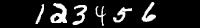
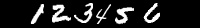
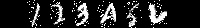
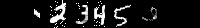

# **Create Digit Sequence**

The create digit sequence package is a convenient tool can be used to generate a huge number of a series of digit 

sequence according to the MNIST dataset. And there also has the function of multi process. When those images are 

generated. They will be neatly outputted into a directory for the next training step.


## **Usage**
```
run.py [-h] [-c CACHE] [-o OUTPUT_PATH] [-r] -num NUMBER
              [-iw IMAGE_WIDTH] [-min MIN_SPACING] [-max MAX_SPACING] [-da]
              [-ra] [-e ERODE_KERNEL ERODE_KERNEL]
              [-d DILATE_KERNEL DILATE_KERNEL] [-a ANGLE] [-n NOISE_RATIO]
              [-m MULTI_CORE] [-s SIZE]

Create sequence digits from MNIST

optional arguments:
  -h, --help            show this help message and exit
  -c CACHE, --cache CACHE
                        Directory to save data in
  -o OUTPUT_PATH, --output_path OUTPUT_PATH
                        Directory to save result in
  -r, --read_from_config
                        True means read parameters from config, False will
                        read from command line
  -num NUMBER, --number NUMBER
                        The sequence which need to be transformed
  -iw IMAGE_WIDTH, --image_width IMAGE_WIDTH
                        Width of output image
  -min MIN_SPACING, --min_spacing MIN_SPACING
                        Minimum space between two digits
  -max MAX_SPACING, --max_spacing MAX_SPACING
                        Maximum space between two digits
  -da, --data_augmentation
                        Data augmentation
  -ra, --random_all     Ture means random selection these data augmentation
                        functions with 0.5 probability,
  -e ERODE_KERNEL ERODE_KERNEL, --erode_kernel ERODE_KERNEL ERODE_KERNEL
                        Image erosion requires accepting two parameters as
                        erode kernel
  -d DILATE_KERNEL DILATE_KERNEL, --dilate_kernel DILATE_KERNEL DILATE_KERNEL
                        Same with erode parameter
  -a ANGLE, --angle ANGLE
                        Rotation angle for every digit
  -n NOISE_RATIO, --noise_ratio NOISE_RATIO
                        Noise ratio for every digit
  -m MULTI_CORE, --multi_core MULTI_CORE
                        Directory to save data in
  -s SIZE, --size SIZE  Directory to save data in
```  

## **Some Examples**

- Test Example
   - Just merge these digits without any augmentation:
```
python3 run.py -num 123456 -iw 200 -min 5 -max 10
```

   - Read from config.py. You can just modify these arguments in config.py. But the `-num` must be stated:
```
python3 run.py -num 123456 -r
```

   - Merge these digits with data augmentation. The data augmentation includes four functions -\>
    Rotation, Add Noise, Erode and Dilate:
```
python3 run.py -num 123456 -iw 200 -min 5 -max 10 -da
```

   - Merge these digits with random data augmentation, random Erode and Dilate kernel and randomly
    choice these four functions:
```
python3 run.py -num 123456 -iw 200 -min 5 -max 10 -da -ra
```

   - Of course you can set these arguments by `[-e ERODE_KERNEL ERODE_KERNEL] 
   [-d DILATE_KERNEL DILATE_KERNEL] [-a ANGLE] [-n NOISE_RATIO]`
   
- Batch Generation Examples
   - If a large number of sequence samples need to be generated, the `-m` can solve the problem efficiently。
   It is recommended to use the same parameters as the cpu core number, and the `-s` indicates the amount generated,
   if the argument `-o` is not stated, the output images will be generated to `./output/(123456)/(1).png`:
```
python3 run.py -num 123456 -m 4 -s 100000 [-o /tmp/output/]
```
